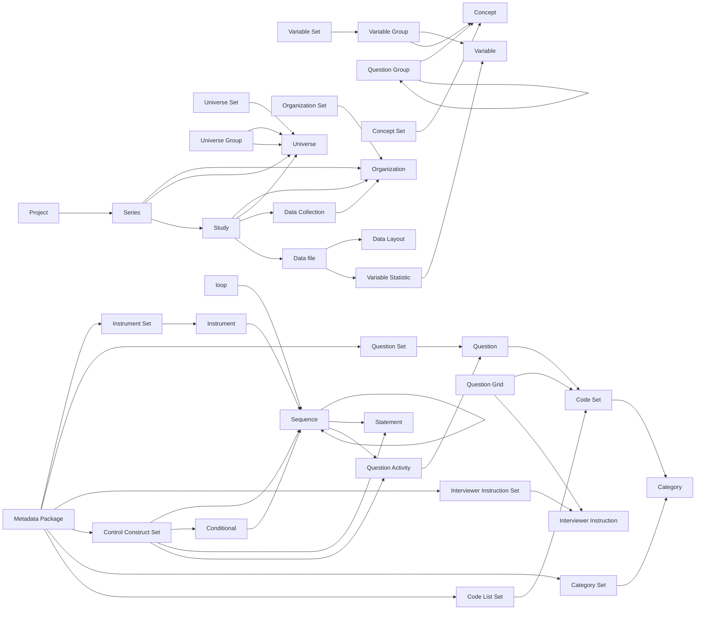

## Overview

Colectica Portal can be accessed using the Rest API. 

Other examples are available on the Colectica Docs at https://docs.colectica.com/portal/api/examples/ 
and the API documentation is available at https://discovery.closer.ac.uk/swagger/index.html

## Installation

```
pip install colectica_api
```

## Basic usage

```
from colectica_api import ColecticaObject
C = ColecticaObject("colectica.example.com", <username>, <password>)
C.search_item(...)
```

See `example.ipynb` for a more complete example.


## Closer Discovery relationship graph

Work-in-progress!


