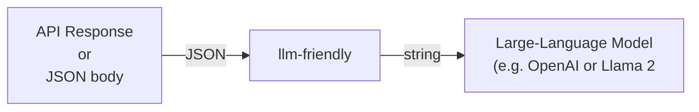

# llm-friendly


[](https://github.com/GovTechSG/llm-friendly/actions/workflows/pytest.yml)


`llm-friendly` converts API responses to LLM-friendly text.



## Currently Supported Source APIs

 - Amazon Web Services (AWS)
   - Textract

[//]: # ( - Azure AI)

[//]: # (   - Vision)

[//]: # ( - Google Cloud Platform &#40;GCP&#41;)

[//]: # (   - Vision)

## Installation

### Latest Stable

```shell
pip install llm-friendly
```

### Latest Development Version

```shell
pip install git+https://github.com/GovTechSG/llm-friendly.git
```

## Usage

Convert your tables into CSV, JSON or Markdown formats.

```python
from llm_friendly.aws import textract

textract_response = {...}
text_content = textract.to_llm_output(textract_response, mode=textract.MODE_CSV) # MODE_JSON or MODE_MARKDOWN
print(text_content)
```

## Tests

```shell
pytest
```

## Similar Projects

- [Unstructured](https://github.com/Unstructured-IO/unstructured/): Supports primarily unstructured formats (Word, PDF, Excel, Email etc)
