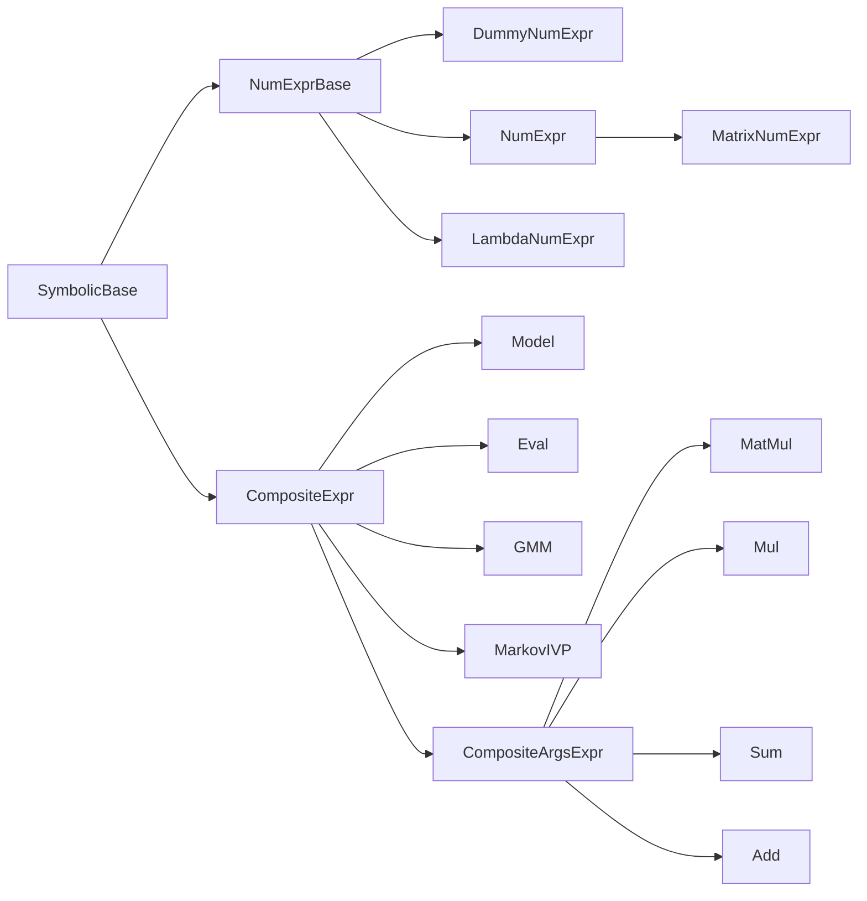

# SlimFit Structure

Current sturcture of `slimfit` model-building classes:

```mermaid
graph LR;
SymbolicBase --> NumExprBase;
SymbolicBase --> CompositeExpr;
NumExprBase --> DummyNumExpr;
NumExprBase --> NumExpr;
NumExprBase --> LambdaNumExpr;
NumExpr --> MatrixNumExpr;
CompositeExpr --> Model;
CompositeExpr --> Eval;
CompositeExpr --> GMM;
CompositeExpr --> MarkovIVP;
CompositeExpr --> CompositeArgsExpr;
CompositeArgsExpr --> MatMul;
CompositeArgsExpr --> Mul;
CompositeArgsExpr --> Sum;
CompositeArgsExpr --> Add;
```